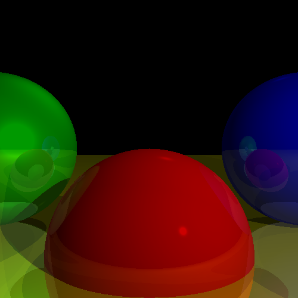

# Task 2 + 3 - Lights and Shadows

## Steps to Run

1. Navigate to the project directory:
   cd "Project 1/Task 2+3"
2. Compile the program:
   javac -d bin src/task23/*.java
3. Run the program:
   java -cp bin task23.Main
4. an output image will be created under Task 2+3 folder

   
