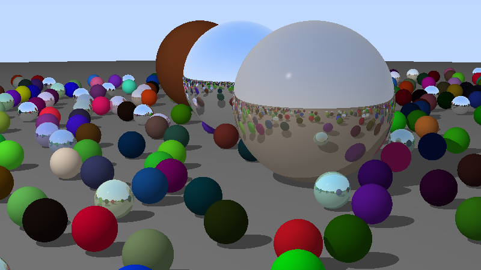

# Task final - Random spheres

## Steps to Run

1. Navigate to the project directory:
   cd "Project 1/Task final"
2. Compile the program:
   javac -d bin src/\*.java
3. Run the program:
   java -cp bin src.Main
4. an output image will be created under Task final folder

